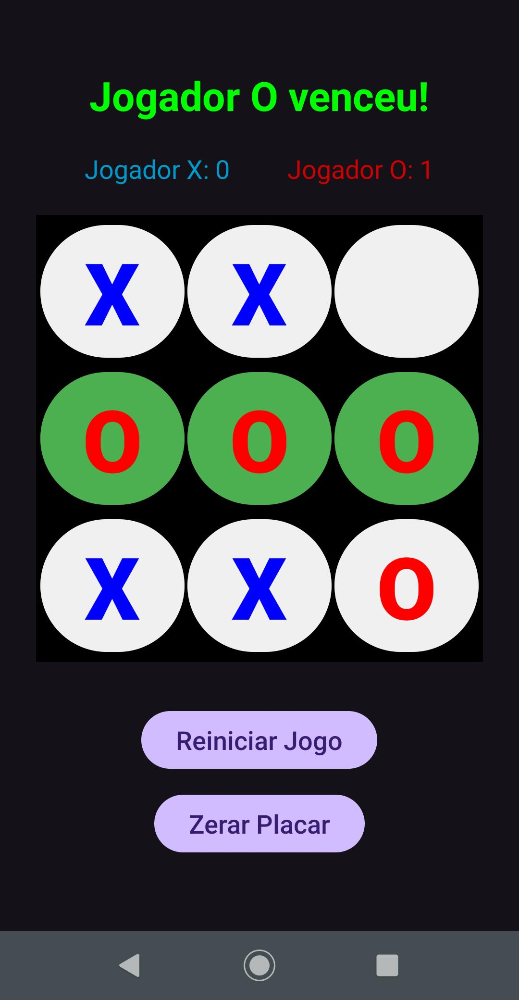

# Tic Tac Toe

Tic Tac Toe is an Android application built with **Kotlin** that allows two players to play the classic game of **Tic Tac Toe** (Jogo da Velha).  
It features a simple and clean interface, keeps track of the **score**, and highlights the **winning combination** on the board.

---

## ✨ Features

- 🎮 Play **2-player Tic Tac Toe** on the same device  
- 🏆 Keep track of **scores for Player X and Player O**  
- 🟢 Highlight the **winning line** when someone wins  
- ⚪ Detect **draws** when the board is full  
- 🔄 **Restart the game** or **reset the scoreboard**  
- 🎨 Clean and intuitive **UI design**  

---

## 📸 Screenshot

### 🏠 Game Screen  
Play the game, see the score, and track the current turn.



---

## 🛠️ Built With

- **Kotlin**  
- **Android Studio**  
- **GridLayout & Buttons** (for the game board)  
- **TextViews** (for score and status)  
- **Material Design Components**  

---

## 🚀 Getting Started

### 1. Clone the repository
```bash
git clone https://github.com/adrprates/tictactoe.git
```

### 2. Open in Android Studio
- Open the project in **Android Studio**  
- Let Gradle sync dependencies automatically  

### 3. Run the app
- Choose an **emulator** or connect a **physical device**  
- Press **Run ▶️**  

---

## 🔗 Notes

- The game is designed for **two players on the same device**  
- **Scoreboard persists** only during the app session  
- Winning line is highlighted in **green (#4CAF50)**  

